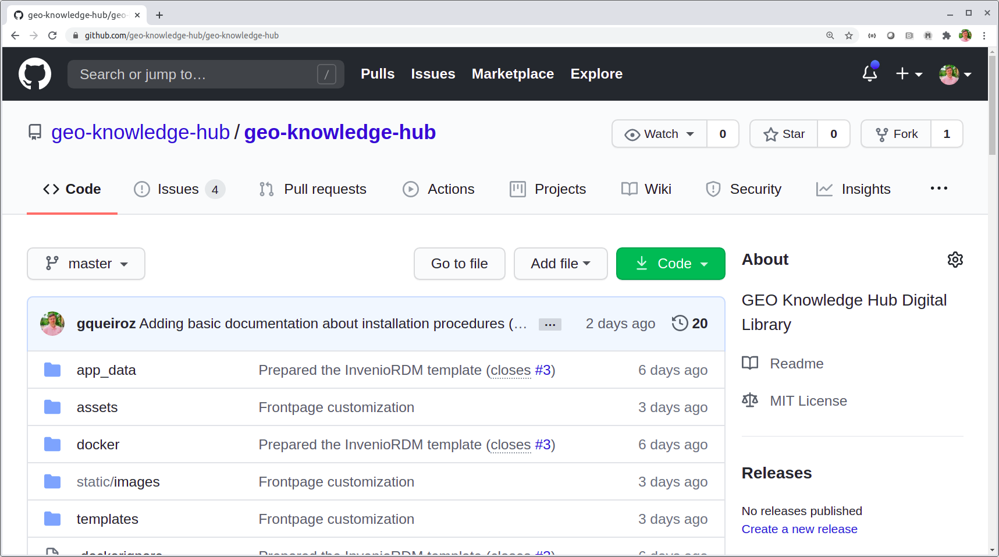
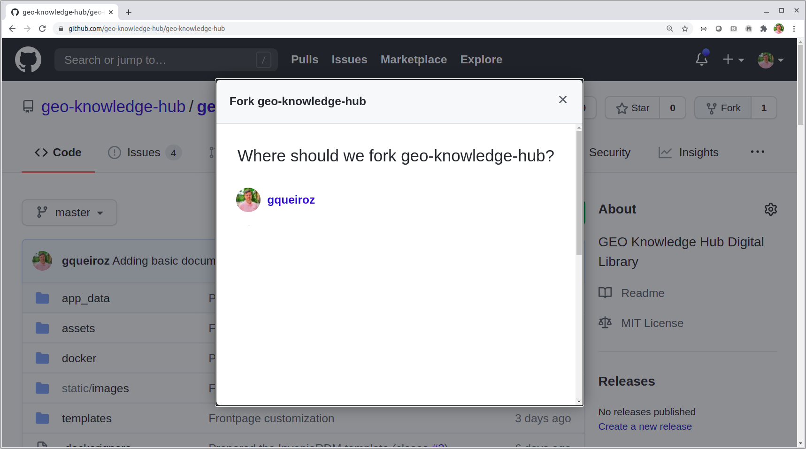
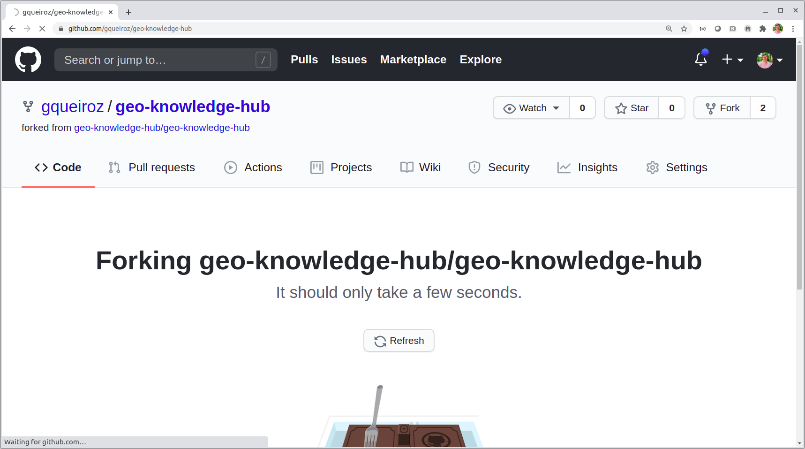
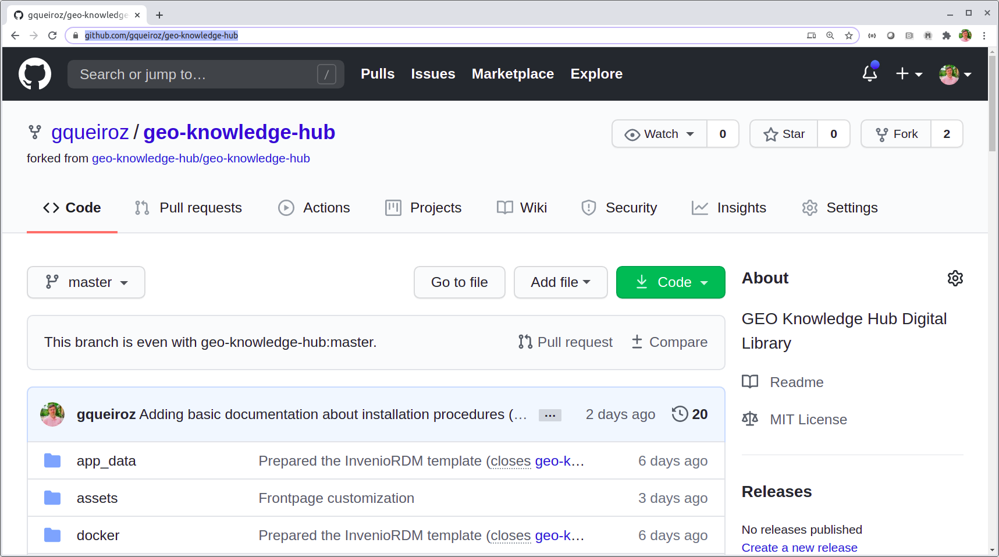
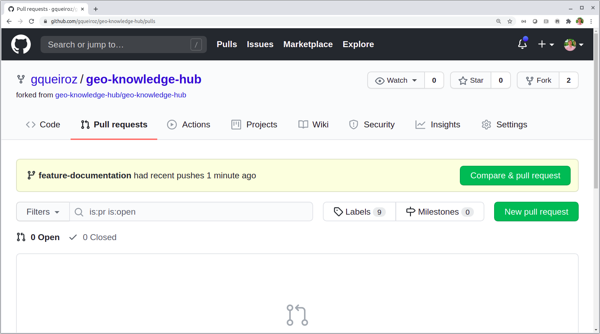
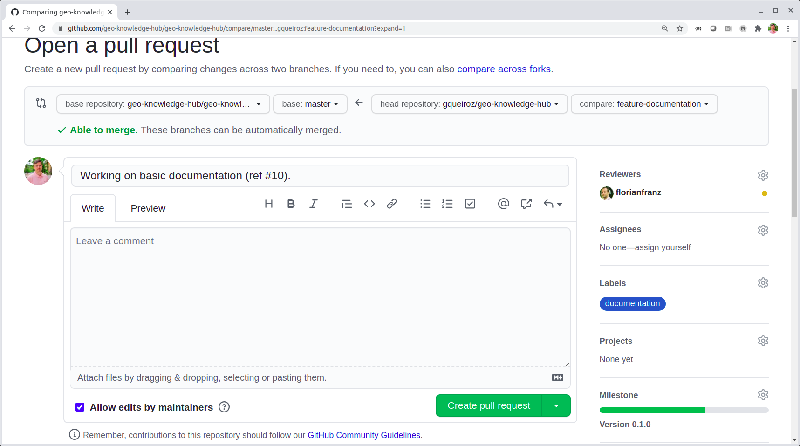
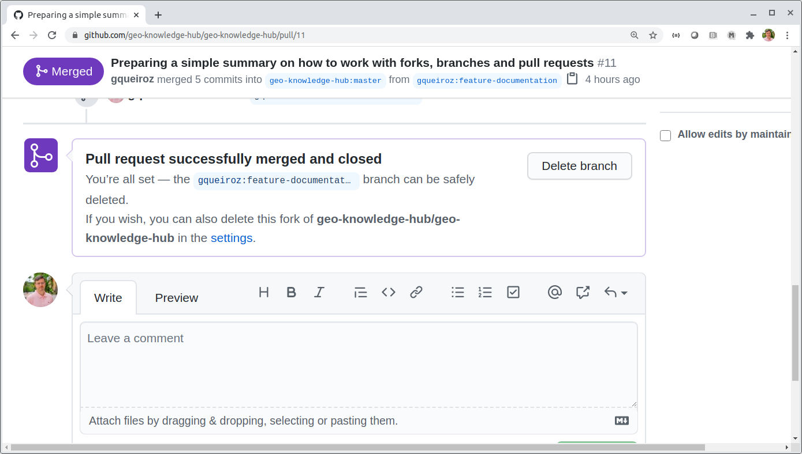

..
    This file is part of GEO Knowledge Hub.
    Copyright 2020 GEO Secretariat.

    GEO Knowledge Hub is free software; you can redistribute it and/or modify it
    under the terms of the MIT License; see LICENSE file for more details.

Tips on How to use Git and GitHub with GEO Knowledge Hub Repository
===================================================================

The ``Fork`` and ``Pull`` Model
-------------------------------

We recommend that developers make a fork of the main GEO Knowledge Hub repository. This section explains how to fork the main repository, push a branch to your fork and then create a pull request in the main GEO Knowledge Hub repository.

Fork
++++

A ``fork`` is a repository related to a parent repository. GitHub keeps track of all repositories forked from the GEO Knowledge Hub and it provides useful tools when you want to compare branches between the main repository and your repository (``fork``). You can create a ``fork`` from the main GEO Knowledge Hub repository page, as highlighted in the picture below. In order to create a fork, select the button ``Fork`` in the main page.

When you press the ``Fork`` button, you will be asked to choose where you should create it. It may be under your account or under one of the organizations that you take part of. Let's assume that you are going to fork under your account (e.g. ``gqueiroz``).

It may take a while to create the fork.

After finishing the creation process you will have a new Git repository under your account, as shown below.

Notice that your repository exhibits an explicit information stating that it was forked from ``geo-knowledge-hub/geo-knowledge-hub``.

Cloning the Repository from your Fork
+++++++++++++++++++++++++++++++++++++

In the terminal, clone your fork with the following command::

    git clone https://github.com/gqueiroz/geo-knowledge-hub.git

Move to the repository folder and configure the e-mail and user name used in Git commands::

    cd geo-knowledge-hub

    git config user.name your-github-login-name

    git config user.email your-email@domain.zz

Adding a remote
+++++++++++++++

In order to be able to collaborate with the code development, you need to manage your remote repositories. If you type::

    git remote -v

You will see that your fork is listed as the ``origin`` remote server::

    origin	https://github.com/gqueiroz/geo-knowledge-hub.git (fetch)
    origin	https://github.com/gqueiroz/geo-knowledge-hub.git (push)

To add a new remote server, use the ``git remote add`` command on the terminal, in the directory your repository is stored at::

    git remote add upstream https://github.com/geo-knowledge-hub/geo-knowledge-hub.git

After that you can verify the new remote server::

    git remote -v

The output should be similar to this one::

    origin	https://github.com/gqueiroz/geo-knowledge-hub.git (fetch)
    origin	https://github.com/gqueiroz/geo-knowledge-hub.git (push)
    upstream	https://github.com/geo-knowledge-hub/geo-knowledge-hub.git (fetch)
    upstream	https://github.com/geo-knowledge-hub/geo-knowledge-hub.git (push)

The ``origin`` points to the address of the repository in your fork under your username (``gqueiroz``), while the ``upstream`` points to the original repository under the ``geo-knowledge-hub`` organization.

.. note::

    For more details about remote servers, check the GitHub Documentation `Adding a remote <https://docs.github.com/en/github/using-git/adding-a-remote>`_ or `Working with Remotes <https://git-scm.com/book/en/v2/Git-Basics-Working-with-Remotes>`_ in the Pro Git book.

Creating a Feature Branch
+++++++++++++++++++++++++

Let's create a new branch named ``feature-documentation`` in your local system::

    git checkout -b feature-documentation

The above command should output something such as::

    Switched to a new branch 'feature-documentation'

You can verify what is the active branch with::

    git branch -a

Output::

    * feature-documentation
      master
      remotes/origin/HEAD -> origin/master
      remotes/origin/master

Committing in the Feature Branch
++++++++++++++++++++++++++++++++

After working in the new feature, it is time to add the new files or stage the changed files::

    git add .

Then, commit the modifications::

    git commit -m "A brief description about the commit (closes #12)"

.. note::

    If possible, include a reference to an issue or indicate that the commit is closing a given issue.

Pushing the Feature Branch
++++++++++++++++++++++++++

The first time you push a branch you need to do::

    git push -u origin feature-documentation

After the first time, you can simply use::

    git push

Creating a Pull Request
+++++++++++++++++++++++

When you push a new branch in your repository (fork), GitHub automatically shows you a button to create a new pull request from this branch.

If you select this option you will be redirected to a page comparing the branches, the ``feature-documentation`` in your fork and the ``master`` branch in the ``geo-knowledge-hub`` main repository. In this page you can assign the pull request to a reviewer, to labels and the milestone. The picture below shows our selection for a pull request.

.. note::

    Notice that the ``head repository`` is pointing to your branch in the fork, and the ``base repository`` pointing to the branch ``master`` in the repository you would like to merge into.

Syncing a fork
--------------

Fetch the branches and their updates from the upstream server::

    git fetch upstream

Then, check out  to your local master branch::

    git checkout master

Merge the changes from ``upstream/master`` into your local ``master`` branch::

    git rebase upstream/master

.. note::

    For more details about syncing a fork, check the GitHub Documentation `Syncing a fork <https://docs.github.com/en/github/collaborating-with-issues-and-pull-requests/syncing-a-fork>`_.

Deleting a Feature Branch
-------------------------

After a pull request is merged from a feature branch, you can remove it from your fork. GitHub offers a button named ``Delete branch`` just right after the symbol in purple indicating that your pull request is merged.

The above action will not remove the feature branch from your local copy. In the case you want to remote it, make sure you are not with this branch active. For example, alter to the ``master`` branch::

    git checkout master

You can remove the branch ``feature-documentation`` from your local repository with the following command::

    git branch -d feature-documentation

.. note::

    In order to remove manually a branch from your fork, use a command such as::

        git push origin --delete feature-documentation

.. note::

    If you want to remove stale references to branches associated to the remote server named ``origin``, you can use the following command::

        git remote prune origin
